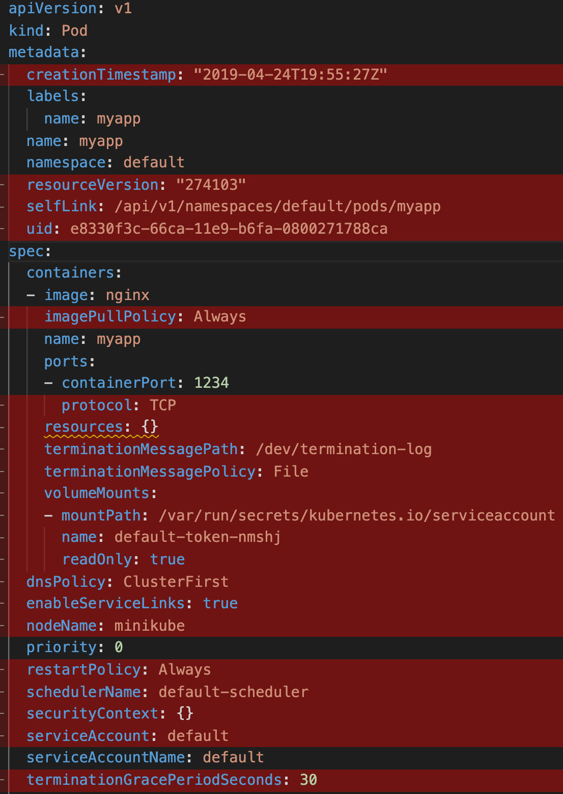

> This readme describes v1.0.0, which is still pending in krew index (the lastest in krew index is v0.1.1).

# kubectl-neat

Remove clutter from Kubernetes manifests to make them more readable.

## Demo

Here is a result of a `kubectl get pod -oyaml` for a simple Pod. The lines marked in red are considered redundant and will be removed from the output by kubectl-neat.



## Why

When you create a Kubernetes resource, let's say a Pod, Kubernetes adds a whole bunch of internal system information to the yaml or json that you originally authored. This includes:

- Metadata such as creation timestamp, or some internal IDs
- Fill in for missing attributes with default values
- Additional system attributes created by admission controllers, such as service account token
- Status information

If you try to `kubectl get` resources you have created, they will no longer look like what you originally authored, and will be unreadably verbose.   
`kubectl-neat` cleans up that redundant information for you.

## Installion

```bash
kubectl krew install neat
```

or just download the binary if you prefer.

When used as a kubectl plugin the command is `kubectl neat`, and when used as a standalone executable it's `kubectl-neat`.

## Usage

You can pipe `kubectl get -o yaml/json` output to it:

```bash
kubectl get pod mypod -o yaml | kubectl neat
```

or any other yaml/json as long as it's a valid Kubernetes resource

```bash
kubectl neat <./my-pod.json
```

or just replace any `kubectl get` command with `kubectl neat`. For example:

```bash
kubectl neat pod mypod -oyaml
kubectl neat svc myservice --output json
```

Any valid option that `kubectl get` accepts should be usable.
